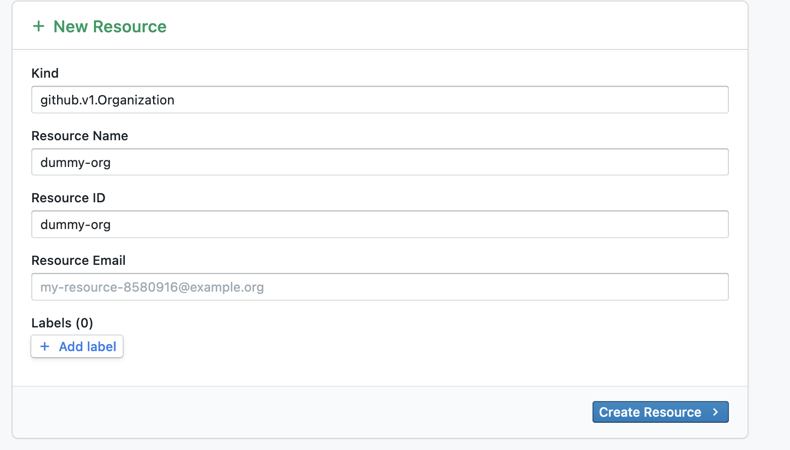
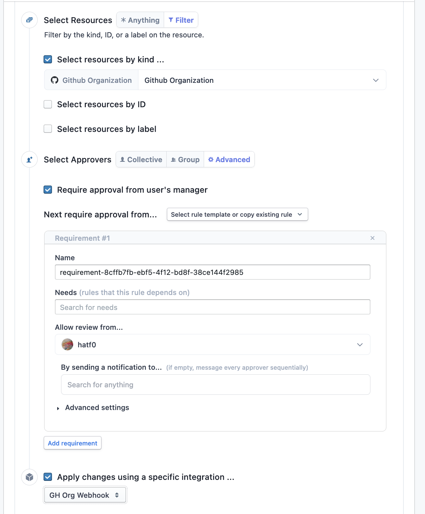

# indent-gh-org-webhook

This is a webhook that intends to allow users to escalate to organizational admin within your GitHub organization for a temporary amount of time. Indent currently only has an integration for escalating to certain teams, which didn't fit our needs perfectly.

## Usage
### Creating a GitHub App
This webhook requires you to create a GitHub app, and install it on your organization account, as the `members` endpoint isn't accessible via PAT (personal access token). 

1. Under your organization settings in GitHub, scroll to the bottom of the page and find "GitHub Apps" under the Developer settings drop-down. Click on "GitHub Apps".
2. Click "New GitHub App", located on the top right-hand side.
3. Name the GitHub app something unique - e.g. "My Organization Indent Org Admin"
4. Fill in the homepage URL with something - does not particularly matter what you set it to. I personally set it to our corporate website.
5. Unclick "Active" under the Webhook header.
6. Scroll to the "Permissions" section, and expand the Organization Permissions dropdown. Within this dropdown, scroll to "Members", and set the access to "Access: Read/Write".
7. Scroll to the bottom, and ensure that "Only on this account" is checked under "Where can this GitHub app be installed?"
8. Click "Create GitHub App".
9. Make note of the "App ID". You'll need this for later.
10. Scroll down to the bottom of the page you were just redirected to, and click "Generate a private key". This will generate a new private key necessary for this webhook's operation.
11. Next, scroll up to the top of the page, and click "Install App" on the left-hand side of the page. Next to your organization name, click "Install". This will then prompt you to confirm your action - go ahead and click "Install".
12. Next, take note of the URL you're currently at. It should be of the format `https://github.com/organizations/(my-org-slug)/settings/installations/(installation-id)`. Take note of this numeric "installation id" as you'll need it later.
13. All done!

### Deploying the webhook
This webhook is designed to be deployed on Cloudflare Workers, however, you can easily adapt this code to run on Lambda or your favorite serverless runtime as necessary. This guide assumes that you're using Cloudflare Workers.

1. First, convert the GitHub private key from PKCS#8 to PKCS#1 using the command:

   ```
   openssl pkcs8 -topk8 -inform PEM -outform PEM -nocrypt -in (your_private_key).pem -out indent-org-mgmt.key
   ```
   Copy down this private key, as you'll need it in one second.
2. Ensure that the `wrangler` CLI utility is installed & that you're authenticated with your Cloudflare account.
3. Copy `wrangler.example.toml` to `wrangler.toml`, and fill in the placeholder values within the configuration file.
4. Next, run `npm i` (or `pnpm i` if you're using `pnpm`) to install all dependencies.
5. Run `npm run deploy`, and take note of the URL that `wrangler` says that your webhook has been deployed to.
6. Next, run `wrangler secret put GITHUB_APP_PRIVATE_KEY` and paste in the private key you converted in the first command.
7. All done! 

### Creating a new dummy GitHub organization resource in Indent
We need to create a dummy resource so that Indent knows that we are adding GitHub organizations to the application. You can delete this after you install the webhook integration.

1. In the admin panel under Indent, click the "Resources" option on the left-hand side of the screen.
2. Click "New" at the top-right of the screen.
3. Fill in the resource modal like so:

4. Click "Create Resource"
### Creating a new webhook integration in Indent
1. In the admin panel under Indent, click the "Integrations" option on the left-hand side of the screen.
2. Find the "Webhooks" panel, and then click on it. Click "Create Webhook"
3. Check "Pull Update" & "Apply Update", and set the resources to "Github Organization".
4. Fill in the Webhook URL with the webhook URL `wrangler` gave you, and click "Show" on the Signing Secret. Copy this, as you'll need it in a second.
5. Click "Create Webhook".
6. Next, go back to the terminal that you deployed the webhook through, and run `wrangler secret put INDENT_WEBHOOK_SECRET`. Paste in the signing secret you copied in the previous step.
7. Go back to the admin panel under Indent, and go to Resources. Click "Pull from Integrations", and check GitHub Organizations. If you set everything up correctly, your GitHub organization should pop up as a resource in Indent.
8. All done!

### Creating an Access Request Rule in Indent
This step is necessary, as Indent will not route any access request approvals to your webhook by default, leading to some odd behavior. Learn from me - I had to figure this out using the support chat.

1. In the admin panel under Indent, go to the Admin tab. Then, click "Add Rule" under "Access Request Rules".
2. Fill in the rule like so, where `GH Org Webhook` is the name of the webhook you created above, and `hatf0` is replaced by the users that you want to approve any requests to become an organization owner.

3. Click "Save" at the top right of the page. This Indent integration is now fully configured.

## Contributing
Contributions are welcome! Please make sure that your code is linted before contributing to this repo. 